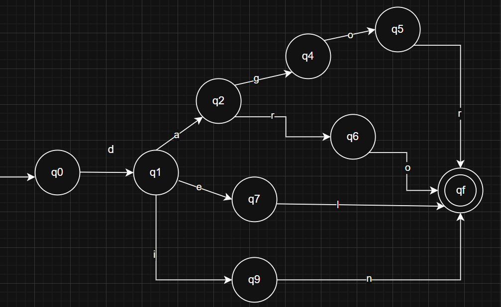

# Evidence Implementation of Lexical Analysis (For Feedback)

Carlos Arturo Gómez Ayala | A01711027  
Prof. Titular: Dr. Benjamín Valdés Aguirre  
Implementation of Computational Methods (Gpo 602)  
ITESM  

---

## About the language

For this evidence I chose a small set of elvish words from LOTR (Excel language 20).

The dialect used has 5 words that all start with the letter "d":

- dae 
- dagor  
- daro 
- del
- din 

---

## Automaton

In class we saw that a DFA (deterministic finite automaton) is a system of states connected by transitions. The automaton reads the word one character at a time and moves between states. If it ends in the accepting state (qf), the word is valid and in the diagram is represented with a double circle.  
If not, the word is imediately rejected.
Paths for each word:

dae → q0→q1→q2→qf

dagor → q0→q1→q2→q4→q5→qf

daro → q0→q1→q2→q6→qf

del → q0→q1→q7→qf

din → q0→q1→q9→qf

## Diagram

---

## Regular Expression

A regular expression is another way to represent the same language:

^(dae|dagor|daro|del|din)$

This matches only those 5 words.

---

## How to run

### Prolog

consult('automaton.pl').
test_dae.
test_dagor.
test_daro.
test_del.
test_din.
test_dog.
test_hello.

### Python

python3 regexp.py

---

## Complexity

The automaton reads each character once, so the time complexity is O(n).

The regex behaves in a similar way for this case.

For these short words, both approaches have almost the same performance.

---

## References

Class notes  
Sudkamp, T. (2006). *Languages and Machines: An Introduction to the Theory of Computer Science*  
https://www.geeksforgeeks.org/finite-automata-introduction/  
https://docs.python.org/3/library/re.html  
GeeksforGeeks. (2021). Python Regex Lookahead. https://www.geeksforgeeks.org/python-regex-lookahead/ (taken and referenced from a given example)
